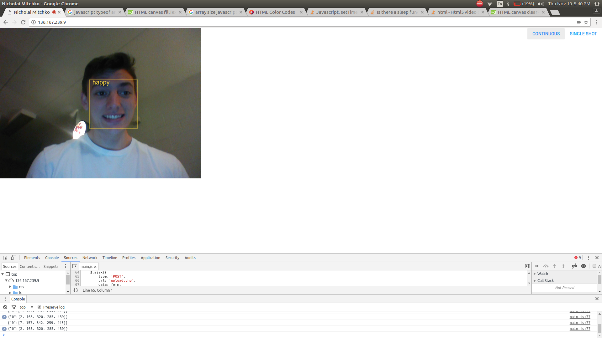

# Endpoint for Neural-Emotion

### Neural-Emotion

A python neural network to predict facial emotions
[LINK](https://github.com/nickmitchko/Neural-Emotion)

### Implementation

* With Apache Installed and document root set to /var/www/html
```BASH
$> pwd
/var/www/
$> ls
html/      <-- This is where this project goes
emotion/   <-- This is where Neural Emotion goes
$> cd emotion
$> nohup python3 auto.py &
```
### WARNING
This is an IO intensive implementation.

### Testing

* in order to test this on a non-secure origin (e.g. no HTTPS) you will need to configure your browser to allow it so.

#### Example (Chrome) => my dev server is at 136.167.239.9
```BASH
$> /opt/google/chrome/google-chrome --unsafely-treat-insecure-origin-as-secure="http://136.167.239.9" --user-data-dir=/home/nicholai/Documents
```

### Screenshots



